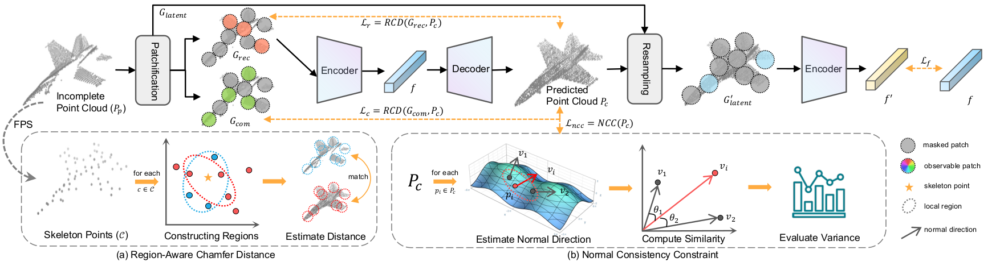

# P2C: Self-Supervised Point Cloud Completion from Single Partial Clouds<br><sub><sub>Official PyTorch implementation of the ICCV 2023 paper</sub></sub>
[[`arXiv`](https://arxiv.org/abs/2307.14726)]
[[`BibTex`](#citation)]




## Introduction
[**P2C: Self-Supervised Point Cloud Completion from Single Partial Clouds**](https://arxiv.org/abs/2307.14726)<br>
Ruikai Cui, Shi Qiu, Saeed Anwar, Jiawei Liu, Chaoyue Xing, Jing Zhang, Nick Barnes


**[abstract]** *Point cloud completion aims to recover the complete shape based on a partial observation. Existing methods require either complete point clouds or multiple partial observations of the same object for learning. In contrast to previous approaches, we present Partial2Complete (P2C), the first self-supervised framework that completes point cloud objects using training samples consisting of only a single incomplete point cloud per object. Specifically, our framework groups incomplete point clouds into local patches as input and predicts masked patches by learning prior information from different partial objects. We also propose Region-Aware Chamfer Distance to regularize shape mismatch without limiting completion capability, and devise the Normal Consistency Constraint to incorporate a local planarity assumption, encouraging the recovered shape surface to be continuous and complete. In this way, P2C no longer needs multiple observations or complete point clouds as ground truth. Instead, structural cues are learned from a category-specific dataset to complete partial point clouds of objects. We demonstrate the effectiveness of our approach on both synthetic ShapeNet data and real-world ScanNet data, showing that P2C produces comparable results to methods trained with complete shapes, and outperforms methods learned with multiple partial observations.*


## Installation

- Python >= 3.7
- CUDA 11.6
- Pytorch >= 1.12
- open3d>=0.9
- transforms3d
- pytorch3d
- pyyaml
- opencv-python
- tensorboardX
- tqdm
- timm==0.4.5
- scipy

Or you can setup the environment using `conda`:
```
conda env create -n p2c
pip install -r requirements.txt
```

Some packages are needed to train and evaluate the model.
- Pytorch Chamfer Distance
- pointops_cuda

To build this, run the command below:
```
bash install.sh
```

## Preparing the Data


1. 3D-EPN dataset [[`Google Drive`](https://drive.google.com/file/d/1-oA4pYO7fidspqtF822kCpbXBs-SlFMC/view?usp=sharing)] [[`BaiduYun`](https://pan.baidu.com/s/1AIAP3V7B-cEEglSWp0oPxg)] (9pc1)

Please download the dataset to `./data/EPN3D/`

2. PCN dataset [[`Infinite Gateway`](https://gateway.infinitescript.com/s/ShapeNetCompletion)] [[`BaiduYun`](https://pan.baidu.com/share/init?surl=Oj-2F_eHMopLF2CWnd8T3A)] (hg24)

3. ScanNet dataset  The dataset should be download from the official [website](http://www.scan-net.org/). We will release instruction for data preparation soon!

**The layout should look like this**
```
├── cfgs
├── data [This is your dataroot]
│   ├── shapenet_synset_dict.json
│   ├── EPN3D
│   │   ├── category.txt
│   │   ├── EPN3D.json
│   │   ├── cabinet
│   │   │   ├── complete
│   │   │   │   ├── 1a1b62a38b2584874c62bee40dcdc539.npy
│   │   │   │   ├── ......
│   │   │   ├── partial
│   │   │   │   ├── 1a1b62a38b2584874c62bee40dcdc539__0__.npy
│   │   │   │   ├── ......
│   │   ├── car
│   │   ├── ......
│   ├── PCN
│   ├── ScanNet
```

## Training
To train a point cloud completion model from scratch, run:

```
python main.py --config ./cfgs/EPN3D_models/P2C.yaml --exp_name your_exp_name
```

## pre-trained models

We provide pre-trained models on the 3D-EPN dataset
 [[`Google Drive`](https://drive.google.com/file/d/1Cj2E2bhx7WsKxg1FMBysJajt4xIL8PD4/view?usp=sharing)] [[`WeiYun`](https://share.weiyun.com/2th1qD9z)] [[`BaiduYun coming soon`](#comingsoon)]
<!-- We provide pre-trained models on the 3D-EPN dataset [[`Google Drive`](https://drive.google.com/file/d/1Cj2E2bhx7WsKxg1FMBysJajt4xIL8PD4/view?usp=sharing)]  -->

## Evaluation
To evaluate a pre-trained P2C model on a dataset with single GPU, run:
```
python main.py --test --save_pred --config ./path_to_config_file/config.yaml --ckpts .path_to_ckpt/ckpt.pth --exp_name your_exp_name
```
where `--save_pred` specifics whether save prediction results.


## <a name="citation"></a>Citing P2C

If you find our work useful to your research, please consider citing:

```BibTeX
@misc{cui2023p2c,
      title={P2C: Self-Supervised Point Cloud Completion from Single Partial Clouds},
      author={Ruikai Cui and Shi Qiu and Saeed Anwar and Jiawei Liu and Chaoyue Xing and Jing Zhang and Nick Barnes},
      year={2023},
      eprint={2307.14726},
      archivePrefix={arXiv},
}
```

## Acknowledgement
This code borrowed heavily from [PoinTr](https://github.com/yuxumin/PoinTr). Thanks for their great work!
