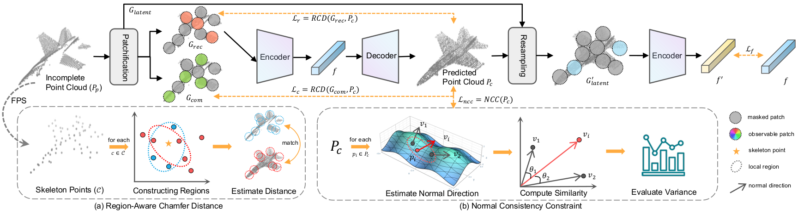

# P2C: Self-Supervised Point Cloud Completion from Single Partial Clouds

<p align="center">
  
</p>

This is the official implementation of "P2C: Self-Supervised Point Cloud Completion from Single Partial Clouds" (ICCV 2023).
[ArXIv](https://arxiv.org/abs/2307.14726)

more instructions coming soon

Run experiments

```
python main.py --config ./cfgs/EPN3D_models/P2C.yaml --exp_name your_exp_name
```

Datasets: 
+ 3DEPN [[GoogleDrive]](https://drive.google.com/file/d/1-oA4pYO7fidspqtF822kCpbXBs-SlFMC/view?usp=sharing); [[BaiduYun]](https://pan.baidu.com/s/1AIAP3V7B-cEEglSWp0oPxg) (9pc1)

## Acknowledgements

Our code is inspired by [PoinTr](https://github.com/yuxumin/PoinTr)
